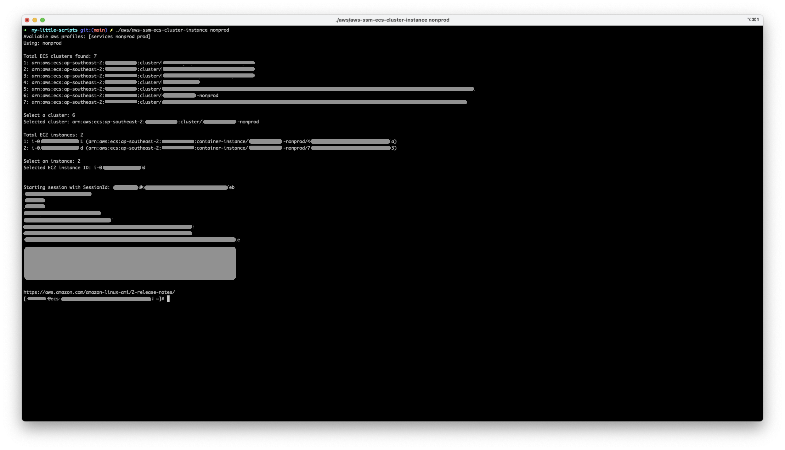
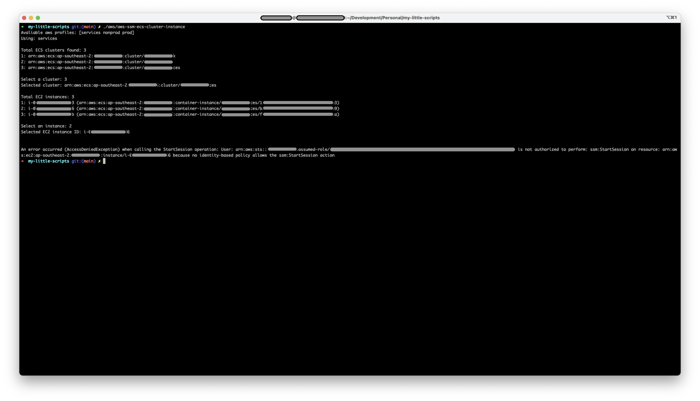

# AWS related scripts

- Prerequisite: AWS CLI >= v2.0.0

### AWS SSM
### [Start a session via SSM to ECS cluster instance](./aws-ssm-ecs-cluster-instance)
- Success

- Failed due to not authorized to perform SSM to particular instance

